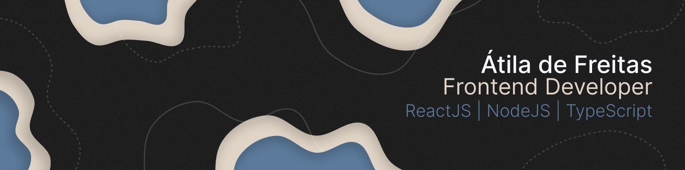

<div id="top"></div>

<br />
<div align="center">
  <a href="https://github.com/othneildrew/Best-README-Template">
    
  </a>
  <h3 align="center">Space Distance Calculator</h3>

  <p align="center">
    An awesome React project by Átila de Freitas
    <br />
  </p>
</div>

<details>
  <summary>Table of Contents</summary>
  <ol>
    <li>
      <a href="#about-the-project">About The Project</a>
      <ul>
        <li><a href="#built-with">Built With</a></li>
      </ul>
    </li>
    <li>
      <a href="#getting-started">Getting Started</a>
      <ul>
        <li><a href="#prerequisites">Prerequisites</a></li>
        <li><a href="#installation">Installation</a></li>
      </ul>
    </li>
    <li><a href="#usage-&-Function-walkthrough">Usage</a></li>
    <li><a href="#contact">Contact</a></li>
  </ol>
</details>

## About The Project

<div align="center">
</div>
</br>
Application developed in React.JS focusing on the consume external API.

In this application you can:

- Measure how many stops you will need to reach your destination.

<p align="right">(<a href="#top">back to top</a>)</p>

### Built With

- [React Native](https://pt-br.reactjs.org/)
- [Styled Components](https://styled-components.com/)

<p align="right">(<a href="#top">back to top</a>)</p>

## Getting Started

### Prerequisites

For run the application you need the following tool:

- npm
  ```sh
  npm install npm@latest -g
  ```

### Installation

1. Clone the repo

```sh
git clone https://github.com/atiladefreitas/Space-Distance-Calculator.git
```

2. Install NPM packages
   ```sh
   npm install
   ```
   or
   ```sh
   yarn install
   ```

<p align="right">(<a href="#top">back to top</a>)</p>

## Usage & Function walkthrough

This application was developed for study and contains some simple features of interaction with the API.

- Fetching data from API

```javascript
  useEffect(() => {
    const fetchData = () => {
      FetchSpaceships().then((res) => {
        if (res !== null) {
          setSpaceship(res.results);
        }
      });
    };
    fetchData();
  }, []);
```

- Mapping and calculating 

```javascript
      {spaceship.map((s) => (
        <div key={s.url}>
          <p>
            {s.name} {Math.ceil(value / s.MGLT)}
          </p>
        </div>
      ))}
```

<p align="right">(<a href="#top">back to top</a>)</p>

## Contact

<div align="center">


</br>
</br>
<p align="center">
<a href="https://www.linkedin.com/in/atilafreitas/"></a>
    &nbsp;
    <a href="https://t.me/atiladefreitas"></a>
    &nbsp;
    <a href="mailto:contact@atiladefreitas.co"></a>
    &nbsp;
    <a href="https://github.com/atiladefreitas"></a>
</p>
</div>
